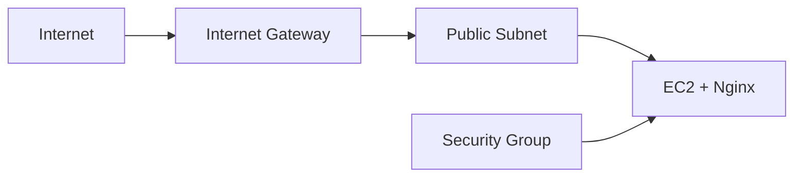
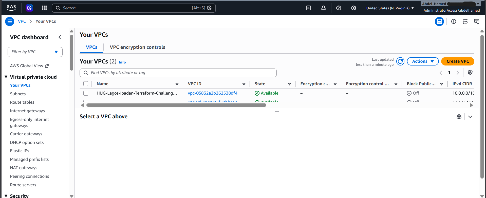
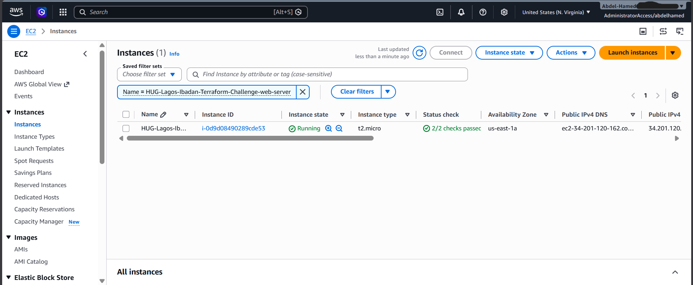
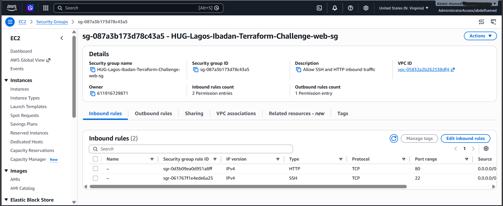
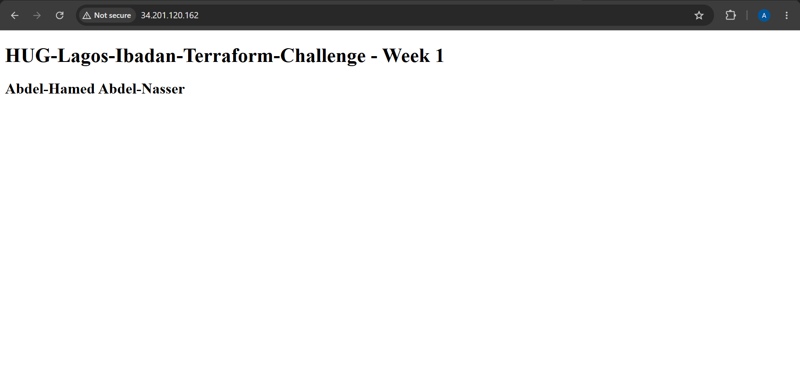

# HUG Terraform Week 1 — AWS Web Server

This Terraform project creates a VPC, public subnet, security group, and Amazon Linux 2 EC2 instance running Nginx.

## Table of Contents

- [HUG Terraform Week 1 — AWS Web Server](#hug-terraform-week-1--aws-web-server)
  - [Table of Contents](#table-of-contents)
  - [Architecture](#architecture)
  - [Prerequisites](#prerequisites)
  - [Deploy](#deploy)
  - [Destroy Resources](#destroy-resources)
  - [Configuration](#configuration)
  - [Troubleshooting](#troubleshooting)
  - [Security](#security)
  - [Screenshots](#screenshots)
    - [VPC](#vpc)
    - [EC2 Instance](#ec2-instance)
    - [Inbound Rules](#inbound-rules)
    - [Web Page](#web-page)

## Architecture



The EC2 startup script installs Nginx and creates a page showing the project name and full name.

## Prerequisites

- AWS account, AWS CLI, and Terraform 1.5+
- Existing S3 bucket: `hug-terraform-bucket-state` in `us-east-1`

> **Note:** The bucket stores Terraform state and must exist before initialization.

## Deploy

Run from `infrastructure/bootstrap`:

```powershell
aws configure
aws sts get-caller-identity
terraform init
terraform validate
terraform plan
terraform apply --auto-approve
```


Wait a few minutes for Nginx to install, then open the URL in a browser.

## Destroy Resources

When you are finished testing, run this command from `infrastructure/bootstrap`:

```powershell
terraform destroy --auto-approve
```

This removes the EC2 instance, security group, subnet, VPC, and other resources created by this project.

> **Warning:** Destroy permanently removes the deployed resources. Run `terraform plan -destroy` first if you want to review what will be deleted.

## Configuration

Edit `infrastructure/bootstrap/terraform.tfvars`.

| Variable | Description | Example |
|---|---|---|
| `aws_region` | AWS region. | `"us-east-1"` |
| `project_name` | Resource name and page title. | `"my-project"` |
| `vpc_cidr` | VPC network range. | `"10.0.0.0/16"` |
| `public_subnet_cidr` | Public subnet range. | `"10.0.1.0/24"` |
| `availability_zone` | AZ; must match the region. | `"us-east-1a"` |
| `instance_type` | EC2 size. | `"t2.micro"` |
| `key_name` | Existing key pair for SSH. | `""` |
| `full_name` | Name on the web page. | `"Abdel-Hamed Abdel-Nasser"` |
| `ingress_ports` | Public TCP ports. | `[80]` |

> **Warning:** `[22, 80]` opens SSH and HTTP publicly. Use `[80]` when SSH is not needed.

## Troubleshooting

| Problem | Solution |
|---|---|
| `AccessDenied` | Run `aws configure` and check S3, EC2, and VPC permissions. |
| Website does not open | Wait a few minutes and ensure `ingress_ports` contains `80`. |
| Key pair error | Use a key pair in the selected region or set `key_name = ""`. |
| Files not found | Run Terraform commands from `infrastructure/bootstrap`. |

## Security

Never commit AWS keys, Terraform state, or secrets. Use least-privilege IAM permissions and destroy unused resources to avoid unnecessary cost.


## Screenshots

### VPC

The VPC created by Terraform in the AWS console.



### EC2 Instance

The Amazon Linux EC2 instance running the web server.



### Inbound Rules

Security group rules allowing the configured inbound ports.



### Web Page

The Nginx web page displayed in a browser after deployment.

