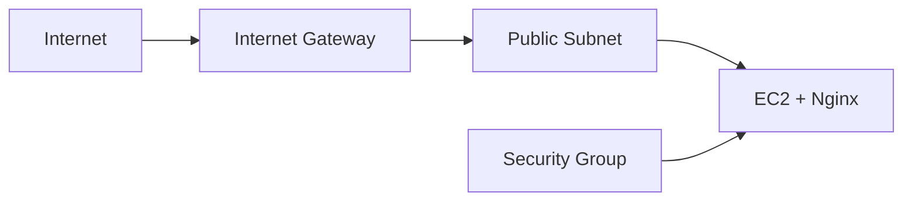
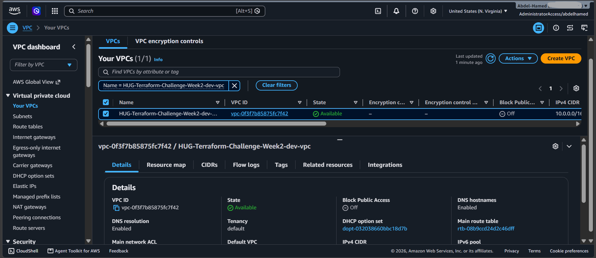
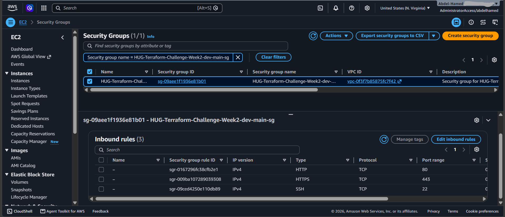
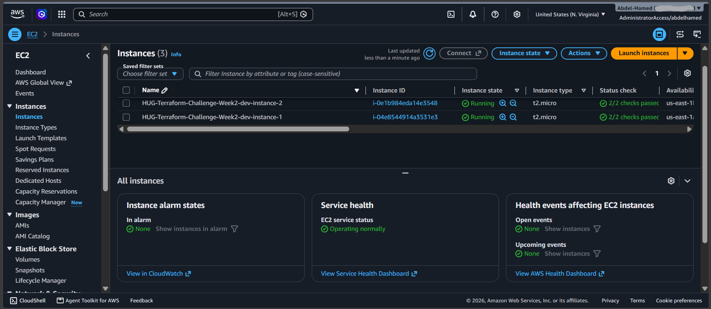
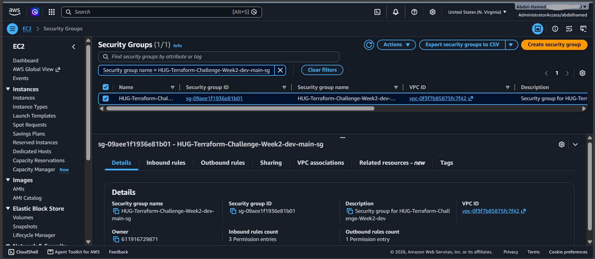
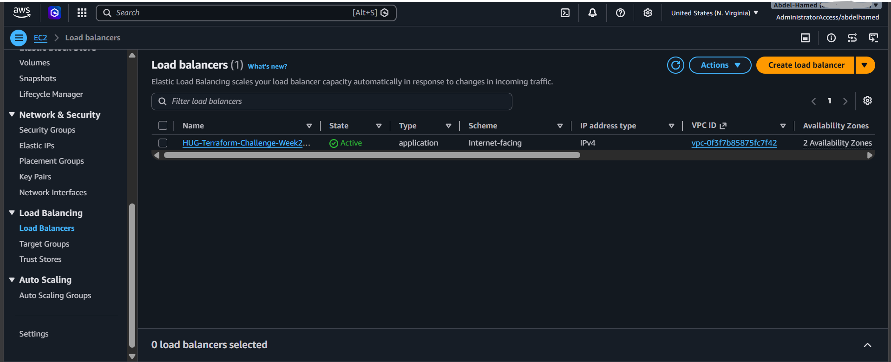
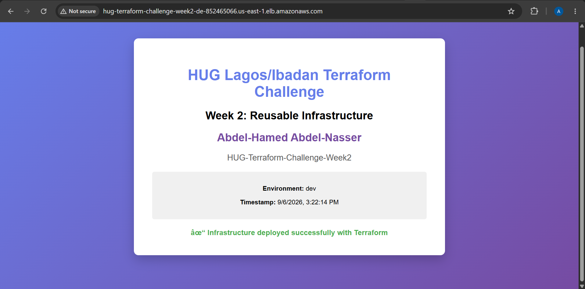

# Week 2 - Reusable Infrastructure with Advanced Module Architecture

This project refactors the Week 1 single-instance setup into a modular, highly available, and reusable cloud architecture on AWS using Terraform. It separates infrastructure into isolated, single-responsibility modules: VPC, Networking (public/private subnets, IGW, and NAT Gateways), Security Groups, Compute (multi-instance EC2 with Launch Template support), and an Application/Network Load Balancer.

State management is configured using an Amazon S3 backend with server-side encryption and modern native S3 state locking (`use_lockfile = true`).

---

## Architecture Overview



---

## Modular Architecture & Separation of Concerns

- **VPC Module (`./modules/vpc`)**: Manages the base `aws_vpc` resource, DNS resolution settings, and core network tagging.
- **Networking Module (`./modules/networking`)**: Handles multi-AZ public and private subnets, Internet Gateway, route tables, and optional single or multi-AZ NAT Gateways for outbound private connectivity.
- **Security Module (`./modules/security`)**: Creates and attaches security groups via dynamic ingress and egress rule sets driven by environment configuration maps.
- **Compute Module (`./modules/compute`)**: Manages multi-instance horizontal scaling (`instance_count`), user-data web server bootstrapping, and launch templates for Auto Scaling readiness.
- **ALB Module (`./modules/alb`)**: Conditionally deploys an Application or Network Load Balancer with HTTP listeners, target groups, health checks, and compute target attachments.

---

## Repository Structure

```text
Week2-ReusableInfrastructure/
├── environments/
│   ├── dev.tfvars
│   ├── staging.tfvars
│   └── prod.tfvars
├── infrastructure/
│   ├── backend.tf
│   ├── main.tf
│   ├── outputs.tf
│   ├── providers.tf
│   ├── terraform.tfvars
│   ├── terraform.tfvars.example
│   ├── variables.tf
│   └── modules/
│       ├── alb/
│       ├── compute/
│       ├── networking/
│       ├── security/
│       └── vpc/
├── screenshots/
│   ├── load-balancer.png
│   ├── multiple-instances.png
│   ├── networking-setup.png
│   ├── security-groups.png
│   ├── vpc-architecture.png
│   └── webpage.png
├── scripts/
│   └── setup_backend.sh
├── .gitignore
└── README.md
```

---

## Prerequisites

- **Terraform CLI**: `>= 1.10.0` (required for native `use_lockfile = true` support).
- **AWS Provider**: `~> 5.0`.
- **AWS CLI**: Installed and authenticated with appropriate IAM permissions for EC2, VPC, S3, and ELB resources.
- **Pre-existing S3 State Bucket**: `hug-terraform-bucket-state` in `us-east-1`.

---

## Remote State Configuration

Remote state is configured in `infrastructure/backend.tf` using Amazon S3:

```hcl
terraform {
  backend "s3" {
    bucket       = "hug-terraform-bucket-state"
    key          = "week-2/terraform.tfstate"
    region       = "us-east-1"
    encrypt      = true
    use_lockfile = true
  }
}
```

> **State Locking**: Native S3 conditional writes (`use_lockfile = true`) handle concurrent deployment locks directly within the S3 bucket without requiring a separate DynamoDB table.

---

## Configuration Reference

Key variables declared in `infrastructure/variables.tf` and configured in `infrastructure/terraform.tfvars`:

| Variable | Description | Type | Example / Default |
| --- | --- | --- | --- |
| `aws_region` | Deployment AWS region | `string` | `"us-east-1"` |
| `project_name` | Name prefix applied to all resources | `string` | `"HUG-Lagos-Ibadan-Terraform-Challenge"` |
| `environment` | Deployment stage environment | `string` | `"dev"` |
| `vpc_cidr` | Network CIDR for the dedicated VPC | `string` | `"10.20.0.0/16"` |
| `availability_zones` | List of target availability zones | `list(string)` | `["us-east-1a", "us-east-1b"]` |
| `public_subnet_cidrs` | CIDR blocks for public subnets | `list(string)` | `["10.20.1.0/24", "10.20.2.0/24"]` |
| `private_subnet_cidrs` | CIDR blocks for private subnets | `list(string)` | `["10.20.101.0/24", "10.20.102.0/24"]` |
| `enable_nat_gateway` | Toggle provisioning of NAT Gateway(s) | `bool` | `true` |
| `single_nat_gateway` | Use a single shared NAT Gateway for cost reduction | `bool` | `true` |
| `instance_type` | EC2 instance capacity | `string` | `"t2.micro"` |
| `instance_count` | Number of compute web instances | `number` | `2` |
| `enable_alb` | Deploy Load Balancer fronting instances | `bool` | `true` |
| `load_balancer_type` | Type of load balancer (`application` or `network`) | `string` | `"application"` |
| `full_name` | Student name rendered on Nginx webpage | `string` | `"Abdel-Hamed Abdel-Nasser"` |

---

## Deployment Guide

### 1. Initialize and Validate

Navigate to the root infrastructure directory and initialize the backend:

```bash
cd infrastructure
terraform init
terraform fmt -recursive
terraform validate
```

### 2. Plan and Deploy

Deploy the dev environment using default variables or overlay variable files:

```bash
# Preview changes
terraform plan

# Apply infrastructure deployment
terraform apply --auto-approve
```

To run alternative environment configurations:

```bash
terraform plan -var-file=terraform.tfvars -var-file=../environments/dev.tfvars
terraform apply -var-file=terraform.tfvars -var-file=../environments/dev.tfvars
```

---

## Verification & Outputs

Inspect outputs after the deployment completes:

```bash
# Print all exported attributes
terraform output

# Output webpage access URL
terraform output -raw webpage_url
```

Test endpoint traffic routing through the load balancer:

```bash
curl -i $(terraform output -raw webpage_url)
```

### Exported Outputs Reference

- **`vpc`**: VPC ID and network CIDR block.
- **`networking`**: Public and private subnet IDs, NAT Gateway IDs, and Internet Gateway ID.
- **`security_group_ids`**: Map of provisioned security group identifiers.
- **`compute`**: Instance IDs, public IPs, public DNS entries, and Launch Template ID.
- **`load_balancer`**: ARN, DNS hostname, and target group ARN.
- **`webpage_url`**: Direct URL routing through the ALB DNS name or instance public IP if ALB is disabled.
- **`terraform_state`**: State bucket and key metadata verification.

---

## Teardown

To tear down all resources and prevent ongoing AWS charges:

```bash
terraform destroy --auto-approve
```

---

## Verification Proofs

| Resource | Screenshot |
| --- | --- |
| **VPC & Subnet Topology** |  |
| **Route Tables & NAT** |  |
| **Multi-Instance Compute** |  |
| **Security Groups** |  |
| **Load Balancer Configuration** |  |
| **Live Web Application** |  |

---
