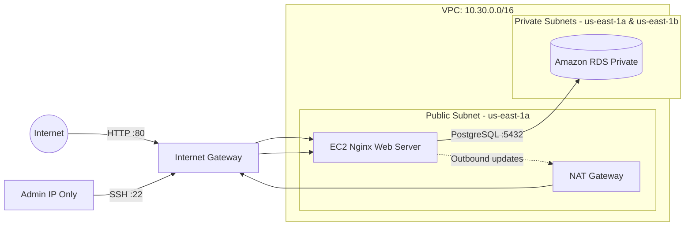
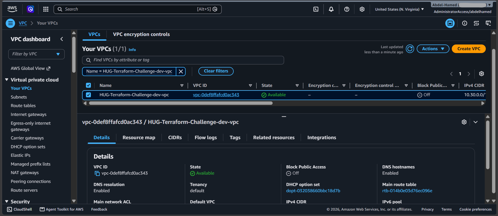
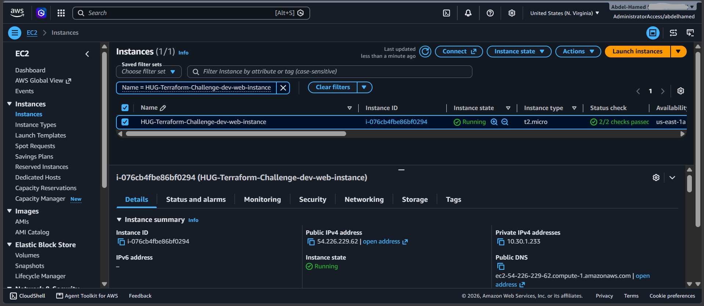
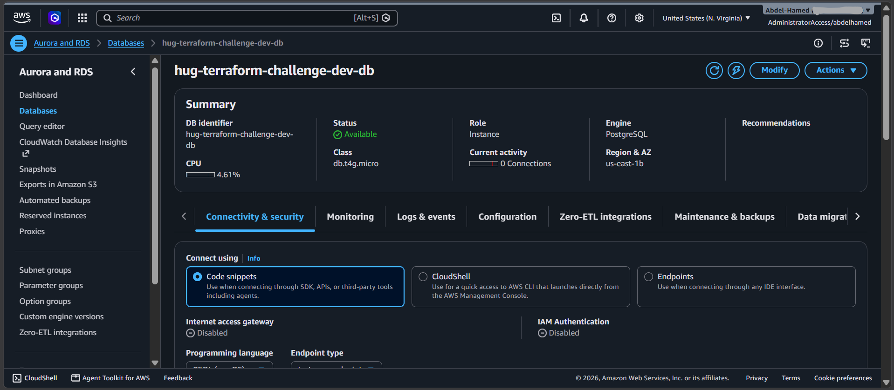
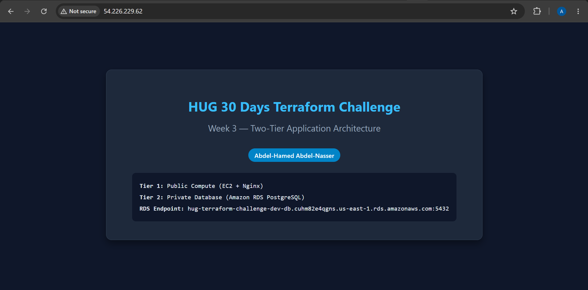

# Week 3: Two-Tier Cloud Architecture

A secure, modular, two-tier application environment on AWS provisioned using Terraform. The architecture decouples the compute tier (Nginx on EC2 in a public subnet) from the database tier (Amazon RDS PostgreSQL in private subnets) following cloud security best practices.

Remote state is managed using Amazon S3 with server-side encryption and modern native S3 conditional write locking (`use_lockfile = true`).

---

## Table of Contents

- [Week 3: Two-Tier Cloud Architecture](#week-3-two-tier-cloud-architecture)
  - [Table of Contents](#table-of-contents)
  - [Architecture](#architecture)
  - [Design Principles \& Security Controls](#design-principles--security-controls)
  - [Project Structure](#project-structure)
  - [Prerequisites](#prerequisites)
  - [Configuration Reference](#configuration-reference)
  - [Deployment Runbook](#deployment-runbook)
  - [Teardown](#teardown)
  - [Verification \& Outputs](#verification--outputs)
    - [Exported Outputs](#exported-outputs)
  - [Deliverables \& Proofs](#deliverables--proofs)

---

## Architecture



---

## Design Principles & Security Controls

* **Least-Privilege Security Chaining**: The RDS PostgreSQL database security group explicitly permits inbound connections on port 5432 **only** when originating from the Web Compute Security Group ID (`source_security_group_id`), preventing all direct internet and broad CIDR exposure.
* **Network Isolation**: The compute instance resides in a public subnet with an Internet Gateway, while the database runs strictly in private subnets with `publicly_accessible = false`.
* **High Availability Subnet Group**: Provisions two private subnets across two distinct Availability Zones (`us-east-1a`, `us-east-1b`) to fulfill AWS RDS DB Subnet Group requirements.
* **Outbound Internet via NAT Gateway**: An Elastic IP and NAT Gateway reside in the public subnet, granting outbound internet connectivity for private tier maintenance without allowing ingress.
* **Native S3 State Locking**: Built for Terraform 1.10+ using `use_lockfile = true`, preventing concurrent execution conflicts without managing a separate DynamoDB table.

---

## Project Structure

```text
Week3-TwoTierApplication/
├── infrastructure/
│   ├── backend.tf               # S3 remote backend with native locking
│   ├── main.tf                  # Root module composition
│   ├── outputs.tf               # Exported resource attributes
│   ├── providers.tf             # AWS provider & version constraints
│   ├── terraform.tfvars         # Deployment input values
│   ├── terraform.tfvars.example # Example variable template
│   └── variables.tf             # Root variable definitions
├── modules/
│   ├── compute/                 # EC2 instance, AL2023 AMI lookup, Nginx bootstrap
│   ├── database/                # RDS PostgreSQL instance & DB subnet group
│   ├── networking/              # Subnets, IGW, NAT Gateway, route tables
│   ├── security/                # Web and RDS security groups
│   └── vpc/                     # Isolated VPC resource
├── screenshots/
│   ├── compute-instance.png
│   ├── database-instance.png
│   ├── vpc-network.png
│   └── webpage.png
└── README.md
```

---

## Prerequisites

* **Terraform CLI**: `>= 1.10.0`
* **AWS Provider**: `~> 5.0`
* **AWS CLI**: Authenticated with credentials having permissions for VPC, EC2, RDS, and S3.
* **Pre-existing S3 State Bucket**: `hug-terraform-bucket-state` in `us-east-1`.

---

## Configuration Reference

Set these variables in `infrastructure/terraform.tfvars`:

| Variable | Description | Type | Example / Default |
| --- | --- | --- | --- |
| `aws_region` | Deployment AWS region | `string` | `"us-east-1"` |
| `project_name` | Resource name prefix | `string` | `"HUG-Terraform-Challenge"` |
| `environment` | Environment identifier | `string` | `"dev"` |
| `vpc_cidr` | Network CIDR for the dedicated VPC | `string` | `"10.30.0.0/16"` |
| `availability_zones` | Target availability zones (min 2) | `list(string)` | `["us-east-1a", "us-east-1b"]` |
| `public_subnet_cidr` | CIDR block for public compute subnet | `string` | `"10.30.1.0/24"` |
| `private_subnet_cidrs` | CIDR blocks for private database subnets | `list(string)` | `["10.30.11.0/24", "10.30.12.0/24"]` |
| `admin_ip` | Your public IP CIDR for restricted SSH access | `string` | `"102.189.20.15/32"` |
| `instance_type` | EC2 compute size | `string` | `"t2.micro"` |
| `key_name` | EC2 key pair name (optional) | `string` | `""` |
| `full_name` | Student name rendered on Nginx page | `string` | `"Abdel-Hamed Abdel-Nasser"` |
| `db_allocated_storage` | Storage allocated for RDS instance (GB) | `number` | `20` |
| `db_instance_class` | RDS compute capacity | `string` | `"db.t4g.micro"` |
| `db_username` | RDS master username | `string` | `"dbadmin"` |
| `db_password` | RDS master password | `string` | `"SuperSecretPassword123#"` |

---

## Deployment Runbook

1. **Find your administrative public IP:**
```bash
curl -s [https://checkip.amazonaws.com](https://checkip.amazonaws.com)
```


Assign `<YOUR_IP>/32` to `admin_ip` inside `infrastructure/terraform.tfvars`.
2. **Navigate to the infrastructure directory:**
```bash
cd infrastructure
```


3. **Initialize the S3 remote backend:**
```bash
terraform init
```


4. **Validate formatting and syntax:**
```bash
terraform fmt -recursive ../
terraform validate
```


5. **Execute deployment:**
```bash
terraform plan
terraform apply --auto-approve
```

---

## Teardown

To avoid unnecessary AWS usage costs, destroy all provisioned resources when testing is complete:

```bash
terraform destroy --auto-approve
```

---

## Verification & Outputs

Inspect outputs after the deployment completes:

```bash
# Display all outputs
terraform output

# Check web endpoint response directly
curl -i $(terraform output -raw web_url)
```

### Exported Outputs

* `vpc_id`: The ID of the VPC.
* `public_subnet_id`: The ID of the public subnet housing EC2 and NAT.
* `private_subnet_ids`: The IDs of the private database subnets.
* `web_public_ip`: Public IP address of the EC2 instance.
* `web_url`: HTTP web application entry point.
* `database_endpoint`: Private DNS endpoint of the Amazon RDS instance.

---

## Deliverables & Proofs

| Resource | Evidence Screenshot |
| --- | --- |
| **Virtual Private Network** |  |
| **Compute Instance (Running State)** |  |
| **Database Instance (Private State)** |  |
| **Live Webpage** |  |

